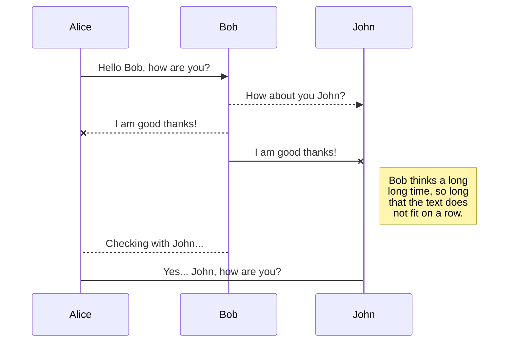
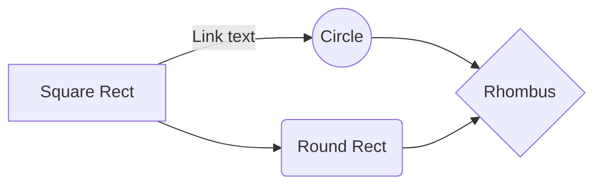



## 1.  请列举 SV39 页表页表项的组成，描述其中的标志位有何作用？
-   **V**: 页表项是否有效
-   **R/W/X**: 控制对应页是否具有读、写、执行权限。这些权限位为操作系统实现内存保护提供了机制。
-   **U**: 控制页的访问级别，标明用户空间是否可以访问。
-   **G**: 全局位用于性能优化，它允许某些页表项在多个上下文之间共享，减少TLB刷新。
-   **A/D**: 访问和脏位用于页面替换策略，帮助操作系统确定哪些页面是活跃的，哪些页面可以被换出内存。
-   **RSW**: 保留位， 留给自定义的实现， 常用于实现**COW**写时复制，用于实现`fork`系统调用时的内存效率优化。

## 2.缺页
缺页指的是进程访问页面时页面不在页表中或在页表中无效的现象，此时 MMU 将会返回一个中断， 告知 os 进程内存访问出了问题。os 选择填补页表并重新执行异常指令或者杀死进程。
### 1.  请问哪些异常可能是缺页导致的？
-   访问了一个没有映射的虚拟地址。
-   访问了映射了虚拟地址但尚未加载到物理内存的页面。
-   访问违反了权限的页面，如对只读页面进行写操作。
###  2. 发生缺页时，描述相关重要寄存器的值，上次实验描述过的可以简略。
-   **PC (Program Counter)**: 保存发生异常指令的地址。
-   **stval/utval (Store/Trap Value Register)**: 保存造成异常的虚拟地址。
-   **satp (Supervisor Address Translation and Protection Register)**: 包含页表的基址和一些控制位，用于地址转换。
###  3. 这样做有哪些好处？
-   减少了初始化时的加载时间，加快了程序启动速度。
-   仅加载实际使用的内存页面，节省了物理内存资源。
-   避免了不必要的I/O操作，提高了系统整体性能。

###  4. 其实，我们的 mmap 也可以采取 Lazy 策略，比如：一个用户进程先后申请了 10G 的内存空间， 然后用了其中 1M 就直接退出了。按照现在的做法，我们显然亏大了，进行了很多没有意义的页表操作。`

处理 10G 连续的内存页面，对应的 SV39 页表大致占用多少内存 (估算数量级即可)？`

10M级

### 5请简单思考如何才能实现 Lazy 策略，缺页时又如何处理？描述合理即可，不需要考虑实现。`

在进程控制块中保存lazy处理的mmap操作，发生缺页中断时查询是否为mmap申请过的地址范围

缺页的另一个常见原因是 swap 策略，也就是内存页面可能被换到磁盘上了，导致对应页面失效。`

此时页面失效如何表现在页表项(PTE)上？`

方法1：页表项Valid位置为0  
方法2：翻转U位，根据虚拟地址和u位值判断页面是否失效（
##  3.# 双页表与单页表

为了防范侧信道攻击，我们的 os 使用了双页表。但是传统的设计一直是单页表的，也就是说， 用户线程和对应的内核线程共用同一张页表，只不过内核对应的地址只允许在内核态访问。 (备注：这里的单/双的说法仅为自创的通俗说法，并无这个名词概念，详情见 KPTI )`

在单页表情况下，如何更换页表？`

将双页表tarp和restore中对页表的切换动作放到_switch中

单页表情况下，如何控制用户态无法访问内核页面？（tips:看看上一题最后一问）

创建地址空间时，内核页面和用户页面的页表项中U位根据特权级设置不同的值，

单页表有何优势？（回答合理即可）`

频繁系统调用时不用切换页表

-   双页表实现下，何时需要更换页表？假设你写一个单页表操作系统，你会选择何时更换页表（回答合理即可）？
     双页表下系统调用、中断/异常均需要更换页表进入内核地址空间 假设我写一个单页表操作系统，仅在task需要切换时更换页表
ecall 
# 补充说明
1.  在完成本次实验的过程（含此前学习的过程）中，我曾分别与 以下各位 就（与本次实验相关的）以下方面做过交流，还在代码中对应的位置以注释形式记录了具体的交流对象及内容：

无

2.  此外，我也参考了 以下资料 ，还在代码中对应的位置以注释形式记录了具体的参考来源及内容：
       
https://github.com/zz2summer/Operating-system-concept/blob/master/%E6%93%8D%E4%BD%9C%E7%B3%BB%E7%BB%9F%E6%A6%82%E5%BF%B5%20%E7%AC%AC7%E7%89%88%20%E4%B8%AD%E6%96%87.pdf
3.  我独立完成了本次实验除以上方面之外的所有工作，包括代码与文档。 我清楚地知道，从以上方面获得的信息在一定程度上降低了实验难度，可能会影响起评分。
    
4.  我从未使用过他人的代码，不管是原封不动地复制，还是经过了某些等价转换。 我未曾也不会向他人（含此后各届同学）复制或公开我的实验代码，我有义务妥善保管好它们。 我提交至本实验的评测系统的代码，均无意于破坏或妨碍任何计算机系统的正常运转。 我清楚地知道，以上情况均为本课程纪律所禁止，若违反，对应的实验成绩将按“-100”分计。
Synchronization is one of the biggest features of StackEdit. It enables you to synchronize any file in your workspace with other files stored in your **Google Drive**, your **Dropbox** and your **GitHub** accounts. This allows you to keep writing on other devices, collaborate with people you share the file with, integrate easily into your workflow... The synchronization mechanism takes place every minute in the background, downloading, merging, and uploading file modifications.

There are two types of synchronization and they can complement each other:

- The workspace synchronization will sync all your files, folders and settings automatically. This will allow you to fetch your workspace on any other device.
	> To start syncing your workspace, just sign in with Google in the menu.

- The file synchronization will keep one file of the workspace synced with one or multiple files in **Google Drive**, **Dropbox** or **GitHub**.
	> Before starting to sync files, you must link an account in the **Synchronize** sub-menu.

## Open a file

You can open a file from **Google Drive**, **Dropbox** or **GitHub** by opening the **Synchronize** sub-menu and clicking **Open from**. Once opened in the workspace, any modification in the file will be automatically synced.

## Save a file

You can save any file of the workspace to **Google Drive**, **Dropbox** or **GitHub** by opening the **Synchronize** sub-menu and clicking **Save on**. Even if a file in the workspace is already synced, you can save it to another location. StackEdit can sync one file with multiple locations and accounts.

## Synchronize a file

Once your file is linked to a synchronized location, StackEdit will periodically synchronize it by downloading/uploading any modification. A merge will be performed if necessary and conflicts will be resolved.

If you just have modified your file and you want to force syncing, click the **Synchronize now** button in the navigation bar.

> **Note:** The **Synchronize now** button is disabled if you have no file to synchronize.

## Manage file synchronization

Since one file can be synced with multiple locations, you can list and manage synchronized locations by clicking **File synchronization** in the **Synchronize** sub-menu. This allows you to list and remove synchronized locations that are linked to your file.

# Publication

Publishing in StackEdit makes it simple for you to publish online your files. Once you're happy with a file, you can publish it to different hosting platforms like **Blogger**, **Dropbox**, **Gist**, **GitHub**, **Google Drive**, **WordPress** and **Zendesk**. With [Handlebars templates](http://handlebarsjs.com/), you have full control over what you export.

> Before starting to publish, you must link an account in the **Publish** sub-menu.

## Publish a File

You can publish your file by opening the **Publish** sub-menu and by clicking **Publish to**. For some locations, you can choose between the following formats:

- Markdown: publish the Markdown text on a website that can interpret it (**GitHub** for instance),
- HTML: publish the file converted to HTML via a Handlebars template (on a blog for example).

## Update a publication

After publishing, StackEdit keeps your file linked to that publication which makes it easy for you to re-publish it. Once you have modified your file and you want to update your publication, click on the **Publish now** button in the navigation bar.

> **Note:** The **Publish now** button is disabled if your file has not been published yet.

## Manage file publication

Since one file can be published to multiple locations, you can list and manage publish locations by clicking **File publication** in the **Publish** sub-menu. This allows you to list and remove publication locations that are linked to your file.

# Markdown extensions

StackEdit extends the standard Markdown syntax by adding extra **Markdown extensions**, providing you with some nice features.

> **ProTip:** You can disable any **Markdown extension** in the **File properties** dialog.

## SmartyPants

SmartyPants converts ASCII punctuation characters into "smart" typographic punctuation HTML entities. For example:

|                |ASCII                          |HTML                         |
|----------------|-------------------------------|-----------------------------|
|Single backticks|`'Isn't this fun?'`            |'Isn't this fun?'            |
|Quotes          |`"Isn't this fun?"`            |"Isn't this fun?"            |
|Dashes          |`-- is en-dash, --- is em-dash`|-- is en-dash, --- is em-dash|

## KaTeX

You can render LaTeX mathematical expressions using [KaTeX](https://khan.github.io/KaTeX/):

The *Gamma function* satisfying $\Gamma(n) = (n-1)!\quad\forall n\in\mathbb N$ is via the Euler integral

$$
\Gamma(z) = \int_0^\infty t^{z-1}e^{-t}dt\,.
$$

> You can find more information about **LaTeX** mathematical expressions [here](http://meta.math.stackexchange.com/questions/5020/mathjax-basic-tutorial-and-quick-reference).

## UML diagrams

You can render UML diagrams using [Mermaid](https://mermaidjs.github.io/). For example, this will produce a sequence diagram:

And this will produce a flow chart:

